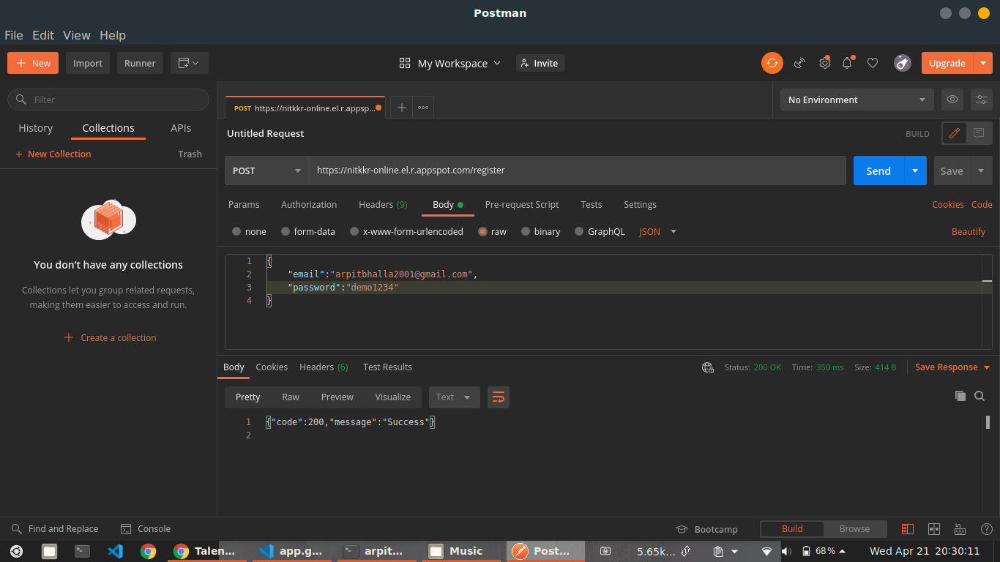
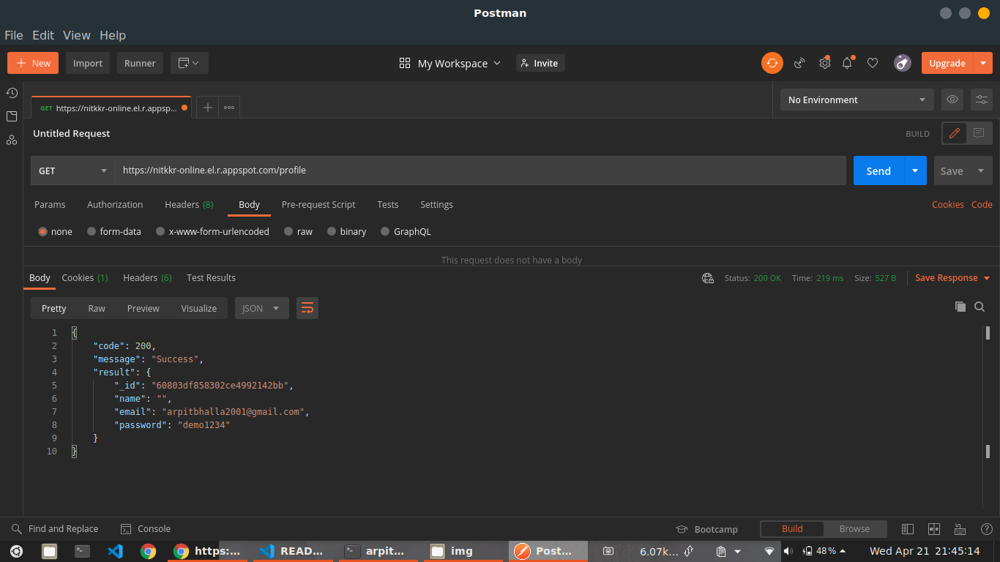
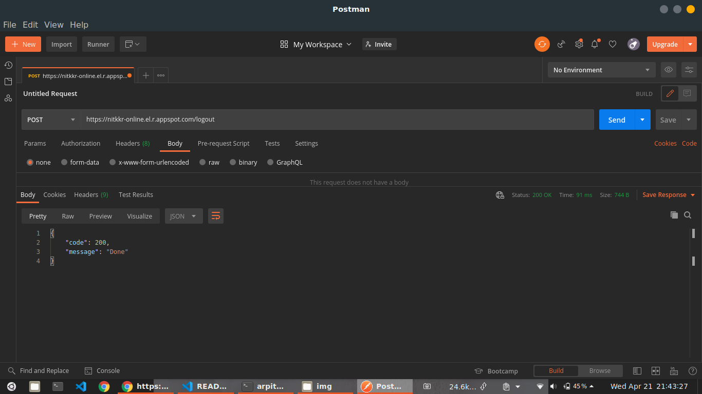
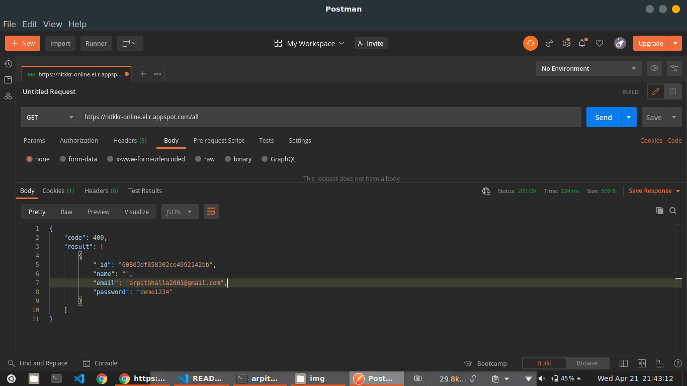

# Gawds Auth Golang

## API

### Base URL

> https://nitkkr-online.el.r.appspot.com/

### Endpoints

#### Register

> **`POST` /register**



#### Login

> **`POST` /login**


#### Get Current User

> **`GET` /profile**



#### Logout

> **`POST` /logout**



#### Get All Users

> **`GET` /all**



**Response**

```json
{
  "code": 400,
  "result": [
    {
      "_id": "60803df858302ce4992142bb",
      "name": "Arpit Bhalla",
      "email": "arpitbhalla2001@gmail.com",
      "password": "demo1234"
    }
  ]
}
```
